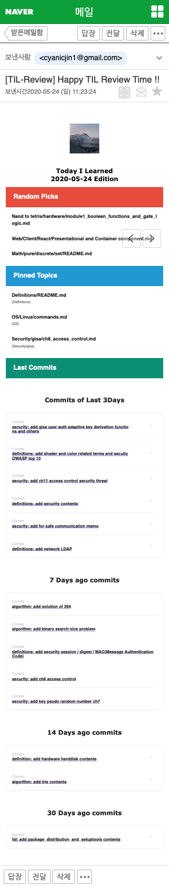

# TIL Review

보다 효율적인 TIL 학습을 위하여

## 개요

예시

- TIL리포지토리를 효율적으로 복습하기 위한 애플리케이션 입니다.
- 매일 Email을 정해진 시간에 보내주도록 하여, 자기주도적 학습을 가능하게 합니다.

## 기능 및 의도

- 과거 3일간의 커밋 보여주기, 7일전 커밋 보여주기, 14일전 커밋 보여주기, 30일전 커밋 보여주기
  - 최근에 공부한 내용 복습
- Pin 해놓은 폴더 중에서 무작위로 마크다운 파일을 선택해서 보여주기
  - 계속해서 꾸준히 복습이 필요한 내용 복습
- Random Pick의 개수만큼 TIL 리포지토리에 있는 임의의 마크다운 파일 보여주기
  - 과거에 작성한 파일을 무작위로 복습하게 하여, long-term 복습 및 파일 수정을 가능하게 하며, 자신의 지식적 성장을 느낄 수 있도록 함

## 설정

- `cmd/config.json`파일을 `config.example.json` 파일의 형식에 기반해서 만들면 됩니다.
- 현재는 본인이 직접 크론탭을 조작해야 합니다.

## 사용법

- 도커 설치
- 프로젝트 디렉터리로 이동
- `cmd/config.json`의 내용을 수정
- `script/production/build_image.sh` 실행
- `crontab -e` 를 이용해서 정해진 시간에 `script/production/run_everyday_review.sh`를 실행
  - e.g) `0 22 * * * /home/ubuntu/TIL-review/script/production/run_everyday_review.sh > /home/ubuntu/TIL-review/log.log 2> /home/ubuntu/TIL-review/error.log`
    - 매일 오후 10시에 복습용 메일을 보내도록 함